# Setupr

> **AI-powered project-control CLI.** Setupr detects your project's stack, plans setup, installs dependencies, configures environments, verifies local health, and keeps the project running — all from one terminal-native command.

   

**TypeScript CLI · stack detection · setup automation · project doctor · terminal dashboard · AI director**

---

## ⚡ TL;DR — What you need to know

| | |
|---|---|
| **Install** | `npm install -g @evan-coder/setupr` &nbsp;·&nbsp; or run instantly with `npx @evan-coder/setupr` |
| **Commands** | `setupr` (the installed binary) — legacy alias `setup` |
| **First run** | `cd your-project` → `setupr` → confirm the warning → the dashboard scans, plans, and sets up |
| **Full setup** | `setupr setup` — scan, install runtime + deps, configure `.env`, verify |
| **Health check** | `setupr doctor` (environment) · `setupr health` (project) · `setupr status` (live dashboard) |
| **AI (optional)** | `setupr auth login` — Setupr works fully without a key; AI only kicks in for novel situations |
| **CI / scripts** | add `--plain` (no TUI) and `--force` (skip safe prompts); `--json` for machine-readable output |
| **Requires** | Node.js ≥ 18, a Unicode-capable terminal |

> **Status: stable public release.** Setupr is ready for npm installation and normal daily CLI use on supported terminals and Node versions.

**Who it's for:** developers who clone projects often and don't want to manually guess install commands, runtime versions, env files, ports, or verification steps.

**Jump to:** [Install](#installation) · [Quick Start](#quick-start) · [Screenshots](#screenshots) · [Commands](#command-reference) · [Flags](#global-flags) · [Features](#features) · [AI Providers](#ai-providers) · [TUI Design](#tui-design--navigation) · [Safety](#safety-policy) · [Config](#configuration) · [Troubleshooting](#troubleshooting)

---

## Installation

Run without installing globally:

```bash
npx @evan-coder/setupr
```

Or install globally:

```bash
npm install -g @evan-coder/setupr
```

The npm package is published under the owned scope `@evan-coder/setupr`, but the installed terminal command is still:

```bash
setupr            # primary binary
setup             # legacy alias (identical)
```

**Requirements**

- Node.js **≥ 18.0.0** for the published CLI (Node 20+ recommended for repo development/CI)
- A terminal with Unicode support for TUI mode

See [SETUP.md](SETUP.md) for the full setup guide, and [docs/project-snapshot.md](docs/project-snapshot.md) for the current repository/maintenance snapshot.

---

## Quick Start

```bash
# Open the project dashboard / home screen
setupr

# Full project setup: scan, plan, install/configure, verify
setupr setup

# Diagnose your environment (runtimes, deps, ports, services)
setupr doctor

# Configure Setupr's AI once, globally (optional)
setupr auth login

# Use fewer prompts while still stopping for serious blockers
setupr setup --force

# Plain terminal output for CI, SSH, or piping
setupr setup --plain
```

**First run walkthrough:** `cd` into any project → run `setupr` → Setupr prints a pre-execution warning and waits for Enter → the TUI launches, scans the project, plans setup steps and shows the agent's reasoning → it asks for missing env values or risky choices only when needed → confirms the final plan → executes → shows a completion summary. You can steer the agent at any time from the persistent input at the bottom (e.g. paste `KEY=value` lines, type `skip build`, or choose `Other...` to override a decision).

### Worked example: cloning a Next.js app on a fresh machine

```console
$ git clone https://github.com/acme/storefront.git && cd storefront
$ setupr setup --plain
⚙  Setupr — project control

→ Scan        TypeScript · Next.js · pnpm · PostgreSQL (detected from pnpm-lock.yaml, next.config.js)
→ Plan        4 steps · AI director: pattern-matched (no API key needed)
   1. Install runtime    pnpm via corepack (Node ≥ 18 satisfied: v20.11.0)
   2. Install deps       pnpm install
   3. Configure env      .env created from .env.example — 2 values missing
   4. Verify             pnpm run build

? .env is missing required values. Paste KEY=value lines, or press Enter to skip:
  DATABASE_URL=  ·  NEXTAUTH_SECRET=
> DATABASE_URL=postgres://localhost:5432/storefront
> NEXTAUTH_SECRET=dev-secret-please-rotate

✓ Install runtime    pnpm 9.x ready                              (1.2s)
✓ Install deps       312 packages installed                     (18.4s)
✓ Configure env      .env complete (2 filled, 0 still missing)   (0.1s)
✓ Verify             next build succeeded                        (22.7s)

✔ Setup complete in 1m 2s. Next: `pnpm dev` — or run `setupr start` to launch + track it.
```

What just happened, mapped to the pipeline below: Setupr scanned the repo, planned 4 steps **without any AI key** (pattern matching was enough), stopped **once** to collect the two missing secrets, ran each step through the safety gate, and saved a checkpoint after every step so an interrupted run could resume with `setupr setup --resume`.

---

## Screenshots

Real output captured from the Setupr CLI (`@evan-coder/setupr`) running against this repository. These are not mockups.

### Project dashboard & status

**`setupr status` — project health, git, env, processes, and recent history at a glance:**

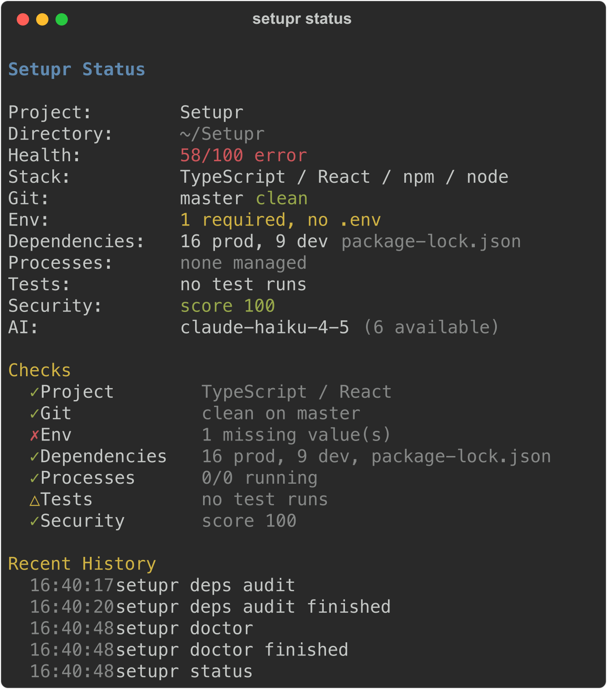

**`setupr status --json` — machine-readable output for CI/CD and scripting:**

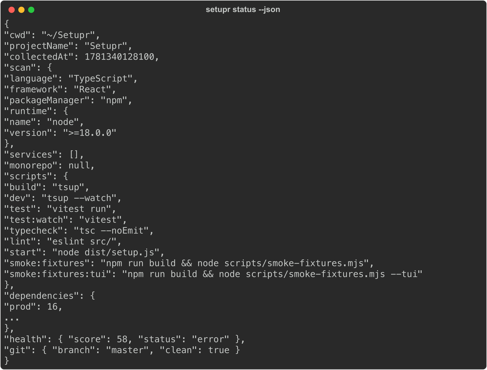

### Diagnostics & health

**`setupr doctor` — runtime, package-manager, and AI-director environment diagnosis:**

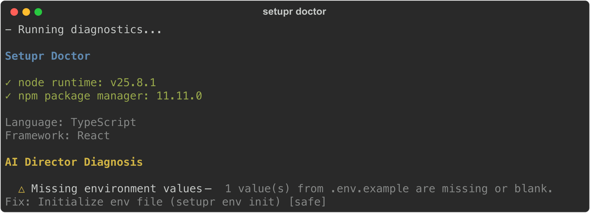

**`setupr health` — full project health check with a pass/warn/fail score:**

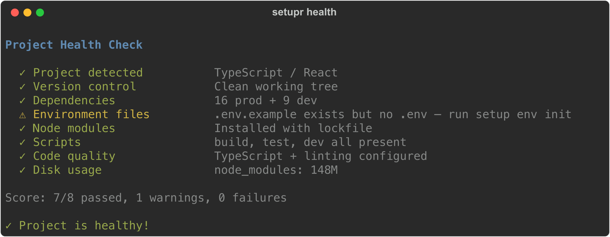

**`setupr env check` — environment validation with a clear, structured error path:**

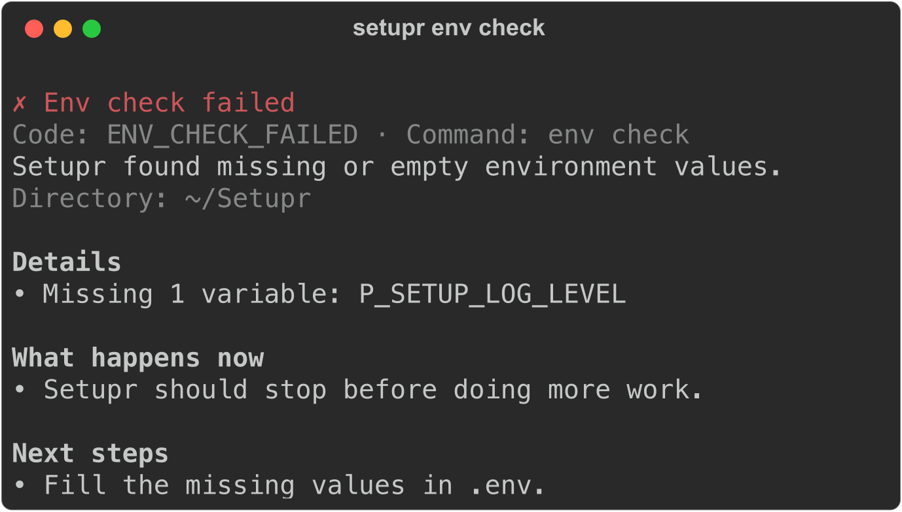

### Project intelligence

**`setupr info` — at-a-glance project summary (language, framework, PM, runtime, deps):**

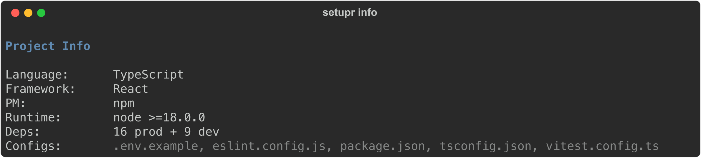

**`setupr deps list` — full dependency tree from the detected package manager:**

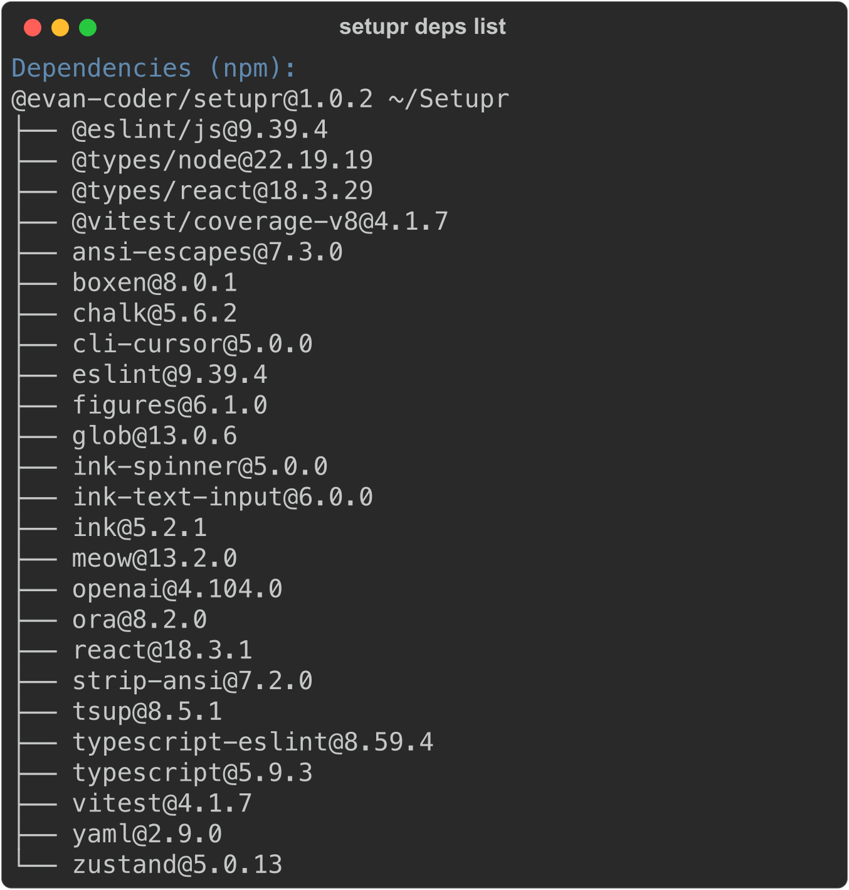

### Verification, release & performance

**`setupr test list` — discovered verification suites with pass/warn/fail status:**

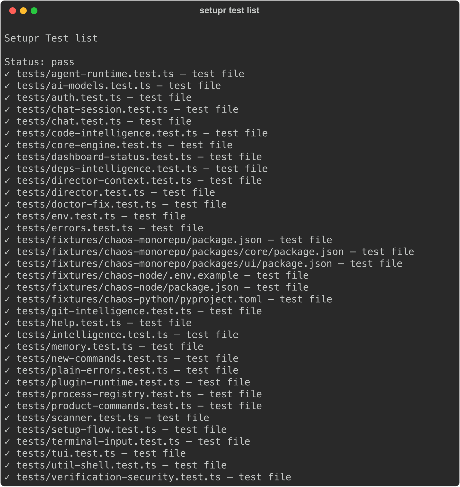

**`setupr release check` — release-readiness gate (package, README, LICENSE, dist, git):**

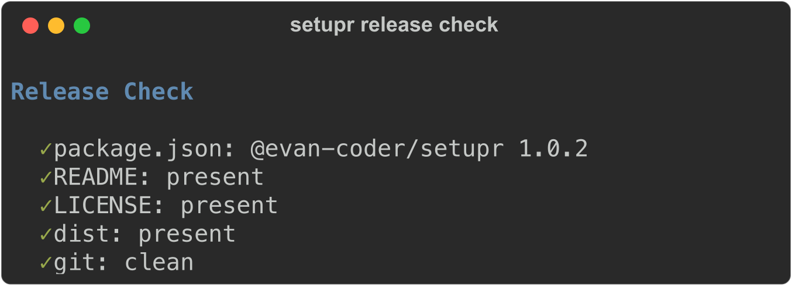

**`setupr perf startup` — scan/context/status performance timings:**

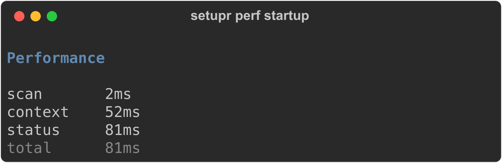

### The full command index

**`setupr --help` — every command and global option, in one screen:**

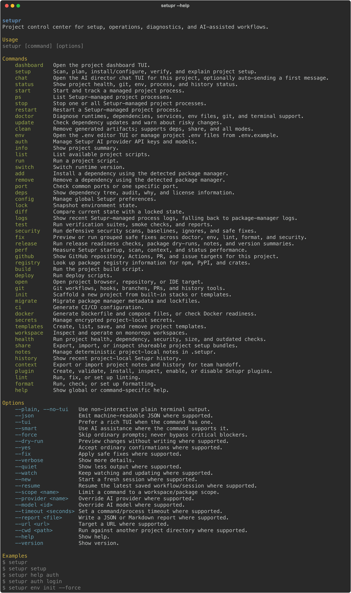

> All Setupr TUIs share one terminal-native visual grammar — see [TUI Design & Navigation](#tui-design--navigation) for the full design system and keyboard map.

---

## Architecture

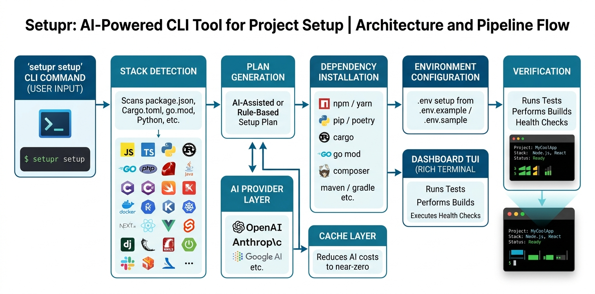

*Stack detection, AI-powered planning, guided TUI setup, and project health monitoring in one CLI.*

These visuals are generated from the actual repository structure and project workflow, not placeholders:

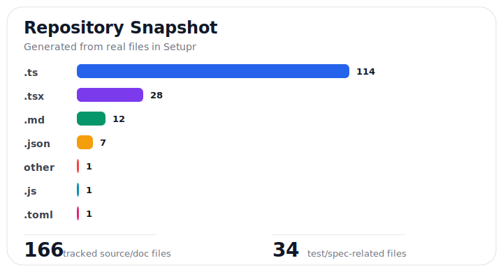

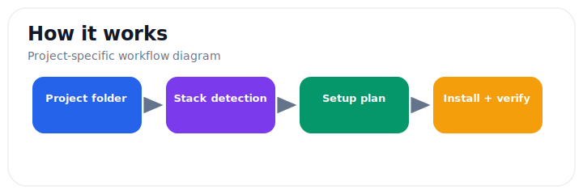

### What happens on a run

From the moment you type `setupr` to the completion summary, every run flows through the same scan → plan → confirm → execute → verify pipeline. The AI director only enters where heuristics are not enough, and every command-like action is gated by the safety layer before it touches your machine:

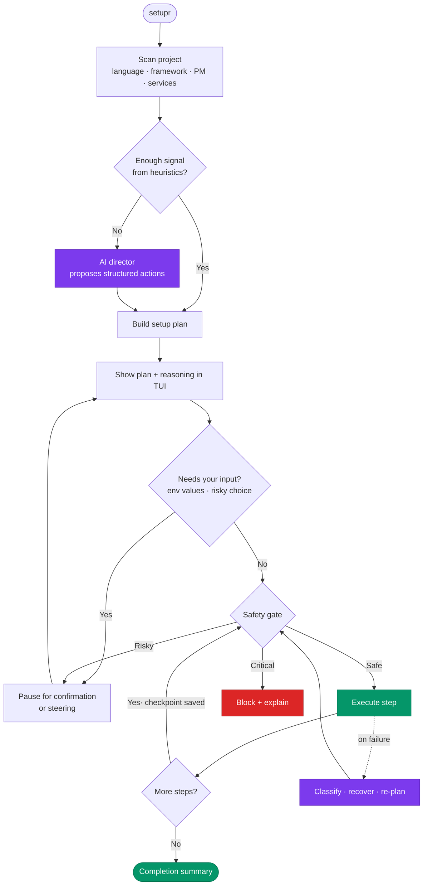

---

## Features

### 🔍 Smart Detection

Setupr automatically detects:

- **Languages**: TypeScript, JavaScript, Python, Rust, Go, Java, Ruby, PHP, Dart, Elixir, Swift, C#, Kotlin, Scala, and more
- **Frameworks**: Next.js, Nuxt, SvelteKit, React, Vue, Angular, Express, Django, Flask, Rails, Spring Boot, and 20+ more
- **Package Managers**: npm, yarn, pnpm, bun, pip, poetry, cargo, go, bundler, composer, pub, mix
- **Services**: PostgreSQL, MySQL, MongoDB, Redis, RabbitMQ, Elasticsearch, Docker
- **Monorepos**: npm workspaces, pnpm workspaces, Turborepo, Lerna, Nx

**Detection priority** — Setupr stops at the first layer that gives a confident answer, so explicit config always wins and the AI is only a last resort:

```mermaid
flowchart LR
    A[".setupr.json<br/>(explicit)"] --> B["package.json<br/>\"setupr\" field"]
    B --> C["File scan<br/>(lock/config files)"]
    C --> D["Content analysis<br/>(dependency inspection)"]
    D --> E["AI fallback<br/>(novel situations only)"]
    classDef hi fill:#2563eb,stroke:#1e40af,color:#fff;
    classDef ai fill:#7c3aed,stroke:#5b21b6,color:#fff;
    class A hi;
    class E ai;
```

### 🤖 AI Director Runtime

Setupr's AI layer is a **director runtime, not a one-shot planner**. It:

- Reads bounded project context from README/setup docs, `.env.example`, package scripts, Docker/Compose files, CI files, and scanner output
- Compresses setup docs into compact facts before model calls (minimal token usage)
- Parses your chat into compact intent facts while preserving the exact raw message for fallback
- Caches context under `.setupr/cache` so startup stays fast
- Turns failures into structured diagnosis and safe re-planning decisions
- Shows plan diffs when chat steering changes the active plan
- Writes workflow checkpoints to `.setupr/agent-workflow.json` so interrupted flows can resume

AI output is **never** treated as raw shell text. The director proposes *structured actions*; Setupr's executor and [safety policy](#safety-policy) decide whether each action is allowed, needs confirmation, or must be blocked.

**3-tier progressive intelligence** keeps it cheap and fast — a query only escalates to a paid model when the two free tiers come up empty:

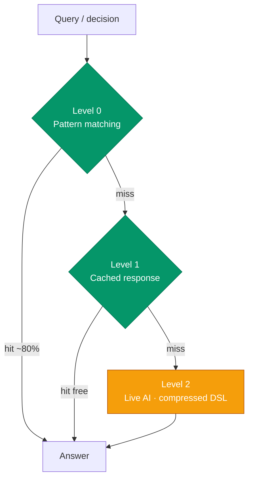

1. **Pattern Matching** (Level 0) — free, instant; handles ~80% of queries
2. **Cached Responses** (Level 1) — free after first hit; smart deduplication
3. **Live AI** (Level 2) — only for novel situations; uses a compressed internal DSL for minimal tokens

> The compressed DSL is internal-only. Generated explanations, docs, code edits, commands, and TUI messages always stay in normal human-readable language.

**Without an API key, Setupr works fully** — it just uses pattern matching and heuristics instead of AI for step planning and chat.

### 🧭 Agent-Guided TUI Flow

The `setup` TUI is an agent workspace, not just a log viewer:

- A plain-text pre-execution warning describes what Setupr may do before the dashboard opens
- The main panel shows a time-ordered timeline: system events, AI decisions, user messages, command output, warnings, confirmations
- When the agent needs input, it pauses with an option card above the persistent chat input
- The director acts on natural language while setup is open: change models, fill env values, skip or rewrite plan steps
- `--force` skips safe prompts and uses defaults where possible — but never invents secrets and still stops for blockers

### 💾 Checkpoint & Resume

- Progress saved to `.setupr/checkpoint.json`; agent workflow state to `.setupr/agent-workflow.json`
- Setup stops on the first failed step (non-zero exit in plain mode)
- Persists across terminals and reboots; auto-cleaned on success

### 🌱 Environment Management

```bash
setupr env            # Open the interactive .env editor TUI
setupr env init       # Create .env from .env.example
setupr env check      # Check for missing/empty variables
setupr env sync       # Sync structure with .env.example
setupr env smart      # Smart reorganize + auto-fill
```

### ✅ Verification & Security

```bash
setupr test quick                                  # Fast local check
setupr test full --report .setupr/test-report.md   # Broader check + report
setupr test doctor                                 # Coverage explanation
setupr security scan                               # Defensive local scan
setupr security deep --report .setupr/security-report.json
```

`setupr test` chooses project-native commands from package scripts, Python, Rust, Go, and common build/lint/typecheck names. `setupr security` runs defensive checks for likely committed secrets, risky env naming, dependency lockfile/version problems, Docker/CI risks, dangerous code primitives, and route/auth smells. Reports are saved under `.setupr/`.

### 🧩 Plugin System

```bash
setupr plugin create team-tools
setupr plugin validate .
setupr plugin doctor
```

Plugins extend Setupr with commands, scanners, planners, doctor checks, fixers, and TUI/dashboard panels. Plugin-proposed work still routes through Setupr's safety systems.

See [docs/FEATURES.md](docs/FEATURES.md) for the full feature reference.

---

## Command Reference

> Run `setupr help` for the live command index, or `setupr help <command>` for a command's own subcommands, flags, and examples.

### TUI commands (rich interactive UI)

| Command | Description |
|---------|-------------|
| `setupr` / `dashboard` | Project dashboard: health, git, env, processes, history, quick commands |
| `setup` | Full project setup — scan, install runtime, deps, env, verify |
| `chat <question>` | AI director chat TUI for questions, steering, plans, logs, and context |
| `status` | Dashboard/status view with plain, JSON, or TUI output |
| `start` | Start and track a managed project process |
| `doctor` | Diagnose environment health (runtimes, deps, ports, services) |
| `update` | Check dependency updates with breaking-change warnings |
| `clean` | Review and remove artifacts (`--deps`, `--share`, `--all`) |
| `env` | Open the `.env` editor TUI, or manage `.env` from `.env.example` |
| `auth` | Manage global Setupr AI provider API keys and models |

### Project intelligence & processes

| Command | Description |
|---------|-------------|
| `info` | Show project summary |
| `list` | List available project scripts |
| `run <script>` | Run a project script |
| `switch <version>` | Switch runtime version |
| `add <package>` | Smart add a dependency with the detected package manager |
| `remove <package>` | Remove a dependency |
| `port [number]` | Check / find / kill a port |
| `deps [list\|audit\|why\|licenses]` | Dependency tree, audit summary, package reasoning, license checks |
| `ps` | List Setupr-managed processes |
| `stop [target]` | Stop one or all managed processes |
| `restart [target]` | Restart a managed process |
| `logs [target]` | Show managed-process logs, falling back to package-manager logs |
| `lock` / `diff` | Snapshot environment state / compare current vs locked |

### Verification, security & release

| Command | Description |
|---------|-------------|
| `test [run\|quick\|full\|ci\|smoke\|unit\|integration\|e2e\|watch\|coverage\|changed\|file\|failed\|doctor\|list\|report\|clean\|fix\|security]` | Run verification suites, smoke checks, and reports |
| `security [scan\|quick\|deep\|deps\|secrets\|env\|docker\|ci\|code\|routes\|auth\|headers\|doctor\|report\|baseline\|ignore\|fix\|watch\|test]` | Defensive security scans, baselines, ignores, safe fixes |
| `fix [doctor\|env\|lint\|format\|security\|all]` | Preview or run grouped safe fixes |
| `release [check\|publish-check\|notes\|version]` | Release-readiness checks, package dry-runs, notes, version summaries |
| `perf [startup\|scan\|context\|status]` | Measure Setupr scan/context/status performance |
| `health [full\|deps\|security\|outdated\|size]` | Run project health checks |
| `lint <run\|setup\|fix>` / `format <run\|check\|setup>` | Run or set up linting / formatting |

### Scaffolding, infra & integrations

| Command | Description |
|---------|-------------|
| `init` | Scaffold new projects from stacks or templates |
| `templates <new\|list\|save\|remove>` | Create, save, list, or remove templates |
| `migrate <npm\|yarn\|pnpm\|bun>` | Migrate package-manager metadata and lockfiles |
| `ci <github\|gitlab\|bitbucket\|circleci>` | Generate CI/CD config |
| `docker <generate\|compose\|check>` | Generate Dockerfile/compose, or check Docker readiness |
| `secrets <init\|set\|get\|list\|remove\|export\|import\|rotate>` | Manage encrypted project-local secrets |
| `workspace <list\|run\|exec\|add\|info\|check>` | Operate on monorepo workspaces |
| `github [status\|ci\|pr\|issue]` | Show GitHub repo, Actions, PR, and issue targets |
| `registry <npm\|pypi\|crates> <package>` | Look up package registry information |
| `build` / `deploy` | Detect and run build / deploy scripts |
| `open [repo\|ide]` | Open project in browser / IDE / repo |
| `git` | Git workflows + commit-message, PR-description, branch-check, conflict helpers |

### Team handoff & extensibility

| Command | Description |
|---------|-------------|
| `share <export\|import\|inspect>` | Export/import shareable setup bundles |
| `notes <add\|list\|remove\|clear>` | Manage project-local notes in `.setupr` |
| `history [list] [limit]` | Show recent project-local Setupr history |
| `context <show\|export\|import>` | Export/import notes + history for team handoff |
| `plugin <create\|validate\|doctor\|install\|remove\|list\|info\|enable\|disable>` | Manage plugins and plugin development |
| `config` | Manage global Setupr preferences |
| `help [command]` | Show global or command-specific help |

See [docs/COMMANDS.md](docs/COMMANDS.md) for the complete reference, including every subcommand and example.

---

## Global Flags

| Flag | Description |
|------|-------------|
| `--plain` / `--no-tui` | Plain terminal output for CI/CD, piping, SSH |
| `--json` | Emit machine-readable JSON where supported (`status`, `ps`, `release`, `perf`, `github`, …) |
| `--tui` | Prefer a rich TUI when the command has one |
| `--smart` | Use AI assistance where the command supports it |
| `--force` | Skip ordinary prompts; install what the project specifies; **never** bypasses critical blockers |
| `--dry-run` | Preview changes without writing, where supported |
| `--yes` | Accept ordinary confirmations, where supported |
| `--fix` | Apply safe fixes, where supported |
| `--watch` | Keep watching and updating, where supported |
| `--new` / `--resume` | Start a fresh / resume the latest saved session or workflow |
| `--scope <name>` | Limit a command to a workspace/package scope |
| `--provider <name>` / `--model <id>` | Override AI provider / model |
| `--timeout <seconds>` | Set a command/process timeout |
| `--report <file>` | Write a JSON or Markdown report |
| `--cwd <path>` | Run against another project directory (errors if the path is missing or not a directory) |
| `--verbose` / `--quiet` | Show more / less output |

**`clean`-specific:** `--deps` (dependency/cache artifacts), `--share` (sensitive/local-only files), `--all` (everything). Positional forms also work: `setupr clean deps|share|all`.

---

## AI Providers

Setupr supports **7 providers (25+ models)**, plus any custom GitHub Models catalog ID:

| Provider | Models | Env Key |
|----------|--------|---------|
| **OpenAI** | gpt-5.5-pro, gpt-5.5, gpt-5.5-mini, gpt-5.4-pro, gpt-5.4-mini, gpt-4o, gpt-4o-mini | `OPENAI_API_KEY` |
| **Anthropic** | claude-opus-4-7, claude-sonnet-4-7, claude-opus-4-6, claude-sonnet-4-6, claude-haiku-4-5, claude-3.5-sonnet | `ANTHROPIC_API_KEY` |
| **Google** | gemini-3.1-pro, gemini-3-flash, gemini-2.5-flash-lite | `GOOGLE_API_KEY` |
| **Groq (Llama)** | llama-4-maverick, llama-4-scout, llama-3.3-70b | `GROQ_API_KEY` |
| **MiniMax** | minimax-m3, minimax-m2.5, minimax-m2.7 | `MINIMAX_API_KEY` |
| **Moonshot (Kimi)** | kimi-latest, kimi-k2-thinking, kimi-k2-turbo-preview, kimi-k2.5-vision, moonshot-v1-128k | `MOONSHOT_API_KEY` |
| **GitHub Models** | openai/gpt-4.1, openai/gpt-4.1-mini, openai/gpt-4o, openai/gpt-4o-mini, or any GitHub catalog ID | `GITHUB_MODELS_API_KEY`, `GITHUB_TOKEN`, or `GITHUB_API_KEY` |

```bash
setupr auth login                 # Guided setup for provider API keys
setupr auth set-key github        # Save one provider key globally
setupr auth list                  # View configured providers (never prints raw keys)
setupr auth test                  # Test configured providers with tiny requests
setupr auth models                # View available models
setupr auth use openai/gpt-4.1-mini   # Set preferred model
```

Setupr stores provider API keys globally in `~/.setupr/secrets.json` with file permissions `0600`. **Raw keys are never printed.** Project `.env` files are for the app being set up — not Setupr's own keys.

Chat with the project-aware director:

```bash
setupr chat
setupr chat "how do I start this app?"
setupr chat "what failed last time?"
setupr chat "switch model to moonshot-v1-128k"
setupr chat --plain "question"    # one-shot output for scripts
setupr chat --new                 # fresh session
setupr chat resume                # resume the latest
```

---

## TUI Design & Navigation

Setupr TUIs share one terminal-native visual grammar:

- **Blue uppercase panel titles**, thin **blue** borders
- **Yellow** focused borders / actions / current work
- **Green** success states · **Yellow** warnings · **Red** failures
- Each command gets a command-specific board rather than one universal layout

**Keyboard & mouse map:**

| Input | Action |
|-------|--------|
| **Arrow keys** | Move between neighboring panels |
| **Tab / Shift+Tab** | Move to next / previous focusable panel |
| **Mouse click** | Focus a panel (terminals with SGR mouse events) |
| **Option/Alt+Arrow** | Move by word (where the terminal supports it) |
| **Option/Alt+Delete or Ctrl+W** | Delete previous word |
| **Ctrl+A / Ctrl+E** | Jump to start / end of input |
| **Ctrl+U / Ctrl+K** | Clear before / after cursor |
| **Enter** | Confirm / submit focused input |
| **Esc** | Leave or skip the active input (where supported) |
| **q** | Quit when focus is not inside an input |

**Behavior notes:** The TUI runs in the terminal alternate screen, so exiting returns you to the original shell history instead of leaving the dashboard in scrollback. It enables SGR mouse reporting and bracketed paste while active, then disables both on cleanup. It does **not** set a background color — Terminal, iTerm2, Ghostty, and other profiles keep their own theme. Interactive inputs stay anchored at the bottom of their panel, wrap within the box, and scroll once they reach the panel's line cap. TUIs require at least a `60x18` terminal grid; smaller windows show a resize notice instead of compressing panels until borders break. If a terminal font/profile renders thin Unicode borders with visible gaps, set `SETUPR_TUI_BORDER=bold`, `double`, `round`, or `classic`.

> `setupr clean` opens a safety review first; type `CLEAN` to delete reviewed targets, or use `--force` only when you intentionally want to skip the review prompt.

---

## Safety Policy

Whether a step comes from heuristics, a plugin, or the AI director, it passes through **one safety layer** before it can run. Risk classification decides the outcome:

```mermaid
flowchart LR
    A[Proposed action] --> B{Risk level?}
    B -->|Safe<br/>checks, installs| C["✅ Run"]
    B -->|Medium / high| D["⚠️ Confirm first"]
    B -->|Critical<br/>rm -rf ~, curl &#124; sh| E["⛔ Block"]
    D -->|approved| C
    F["--force"] -.->|skips ordinary prompts only| D
    F -.->|never overrides| E
    classDef safe fill:#059669,stroke:#047857,color:#fff;
    classDef warn fill:#f59e0b,stroke:#b45309,color:#fff;
    classDef danger fill:#dc2626,stroke:#991b1b,color:#fff;
    class C safe;
    class D warn;
    class E danger;
```

- ✅ Safe checks and normal dependency installs run freely
- ⚠️ Medium/high-risk actions require confirmation
- ⛔ Critical actions (root/home wildcard deletion, `curl | sh`, unsafe elevated commands) are **blocked**
- `--force` skips ordinary prompts but **never** bypasses high-risk or critical blockers

See [SECURITY.md](SECURITY.md) for the vulnerability and secret-handling policy.

---

## Configuration

```text
~/.setupr/config.json      # Global config
~/.setupr/secrets.json     # Global provider API keys (chmod 0600, never printed)
.setupr/                   # Project-local cache, checkpoints, reports, notes, history
```

Project-level config (`.setupr.json`):

```json
{
  "language": "TypeScript",
  "framework": "Next.js",
  "runtime": "node",
  "packageManager": "pnpm"
}
```

See [ENVREADME.md](ENVREADME.md) for environment-variable details.

---

## CI/CD Usage

```bash
setupr --force --plain     # non-interactive: skip safe prompts, no TUI
```

Setupr still avoids inventing secrets and stops for destructive or blocked actions. If any setup step fails in plain mode, Setupr stops immediately and returns a **non-zero exit code** so CI fails correctly. Use `--json` for machine-readable status in pipelines.

---

## Release Smoke Testing

Before publishing, or after touching scanner, error, auth, env, command-execution, or TUI code:

```bash
npm run typecheck
npm run lint
npm test
npm run smoke:fixtures
npm run smoke:fixtures:tui
```

For local package/install smoke:

```bash
pkg=$(npm pack --silent)
npm exec --yes --package "./$pkg" -- setupr --version
npx --yes "file:$(pwd)/$pkg" --version
npm publish --dry-run
rm -f "$pkg"
```

> Use `file:` or `--package` for tarball checks. A bare `npx ./$pkg` is treated like an executable file path and fails. Scoped packages must be public when published, so `package.json` sets `publishConfig.access = "public"`.

---

## Troubleshooting

Common issues and fixes live in [TROUBLESHOOTING.md](TROUBLESHOOTING.md). Quick pointers:

- **`setupr` not found after global install** → ensure your npm global bin is on `PATH`
- **TUI looks broken / boxes mangled** → use a Unicode-capable terminal; try `--plain`
- **`INVALID_CWD` error** → the `--cwd` path doesn't exist or isn't a directory
- **AI features inactive** → run `setupr auth login`; Setupr still works fully without a key

---

## Documentation Map

| Doc | Contents |
|-----|----------|
| [SETUP.md](SETUP.md) | Full setup & first-run guide |
| [docs/COMMANDS.md](docs/COMMANDS.md) | Complete command + subcommand reference |
| [docs/FEATURES.md](docs/FEATURES.md) | Detailed feature documentation |
| [ENVREADME.md](ENVREADME.md) | Environment-variable reference |
| [TROUBLESHOOTING.md](TROUBLESHOOTING.md) | Common problems & fixes |
| [SECURITY.md](SECURITY.md) | Security & secret-handling policy |
| [CONTRIBUTING.md](CONTRIBUTING.md) | Contribution guide |
| [CHANGELOG.md](CHANGELOG.md) | Version history |
| [docs/project-snapshot.md](docs/project-snapshot.md) | Repository/maintenance snapshot |

---

## Contributing

Contributions welcome — see [CONTRIBUTING.md](CONTRIBUTING.md). Development setup:

```bash
git clone https://github.com/Evan1108-Coder/Setupr.git
cd Setupr
npm install
npm run build
node dist/setup.js --help
```

## License

[MIT](LICENSE) © Evan Lu
