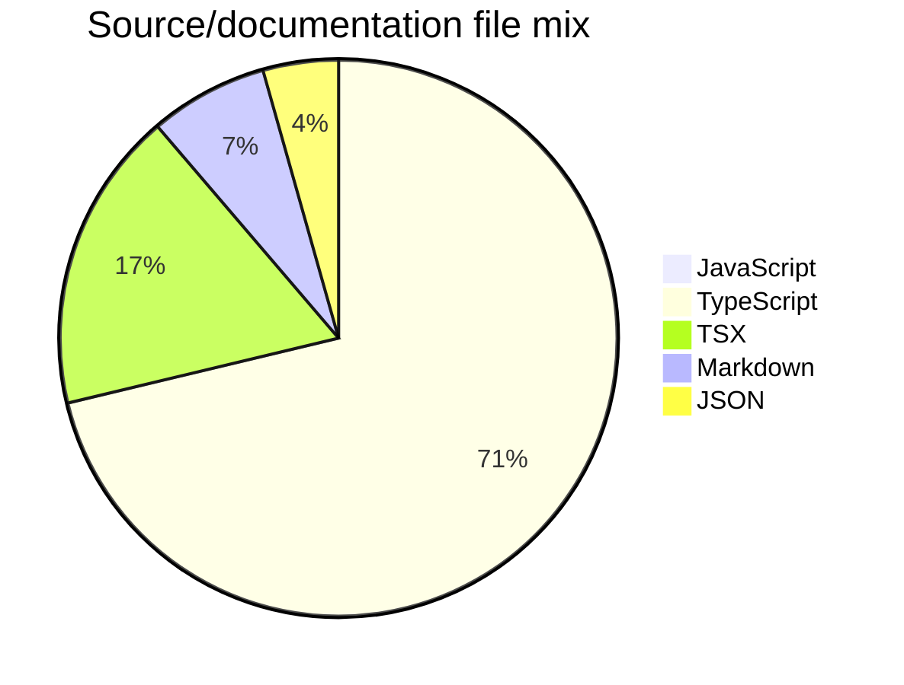

# Project Snapshot

Generated from the repository tree for public README/maintenance polish. Counts exclude `.git`, dependency folders, and build outputs.

## File Mix

- TypeScript: 114 files (71%)
- TSX: 28 files (17%)
- Markdown: 11 files (7%)
- JSON: 7 files (4%)
- JavaScript: 1 files (1%)

## Maintenance Checklist

- README describes purpose, setup, and limitations.
- CI runs baseline install/test/build checks where applicable.
- SECURITY.md explains vulnerability and secret handling.
- CHANGELOG.md tracks public changes.
- Issue and PR templates are available.

## Real Test Snapshot

- `npm test -- --runInBand` completed successfully on 2026-06-08.
- Current suite footprint: 28 Vitest files / 3,555 test lines under `tests/`.
- Coverage areas visible from filenames: auth, environment handling, dependency intelligence, git intelligence, TUI, setup flow, plugins, scanner, memory, and verification security.
